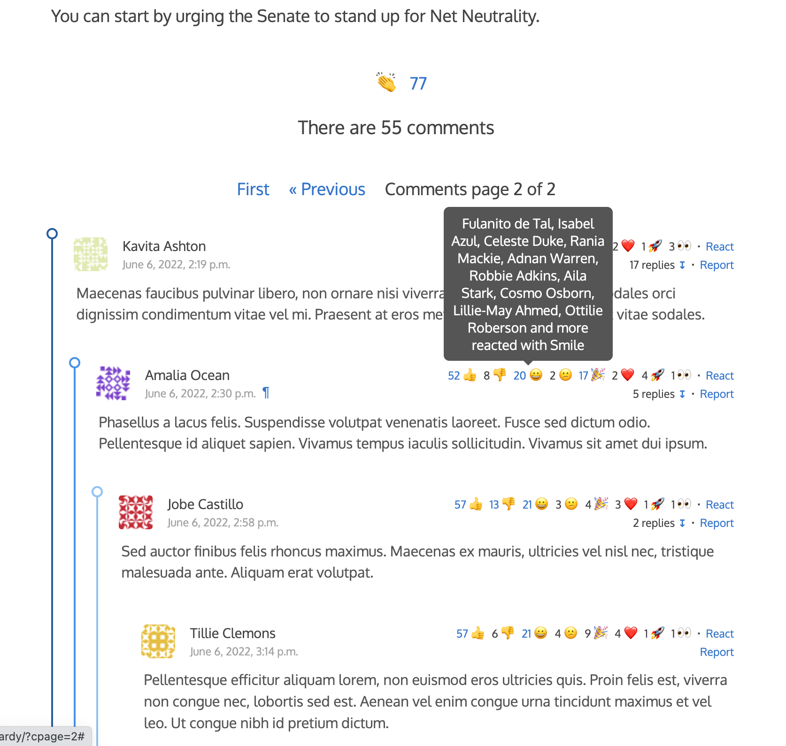

# dci-project-stories

 1. [Features](#1-features)
 2. [Run in Docker](#2-run-in-docker)
 3. [Run in your host OS](#3-run-in-your-host-os)
 4. [Abour users](#4-about-users)

## 1. Features

 * Lightweight JavaScript frontend, free of dependencies.
 * Users and visitors can send comments and replies.
 * The maximum thread level is three. Three is the maximum that django-comments-ink CSS stylesheet covers. Despite it is supported it makes difficult to follow up on every conversation thread.
 * Users can send reactions to each story by clicking on the clapping icon displayed at the bottom of each story. Clapping is the only allowed reaction to stories. It has been customized by modifying the setting [`COMMENTS_INK_OBJECT_REACTIONS_ENUM`](https://github.com/comments-ink/django-comments-ink/blob/0abfbee5e02a8886f646d4bd39b3e4d89e699823/django_comments_ink/conf/defaults.py#L38).
 * Users can also send reactions to each comment. The available reactions for comments in this project are the same as the reactions for objects. Modify the setting [`COMMENTS_INK_COMMENT_REACTIONS_ENUM`](https://github.com/comments-ink/django-comments-ink/blob/0abfbee5e02a8886f646d4bd39b3e4d89e699823/django_comments_ink/conf/defaults.py#L35) to change the list of reactions available for comments.
 * Users can vote for comments, and the list of comments is sorted by the vote score. Comment votes can be enabled/disable using the `comment_votes_enabled` entry of the `COMMENTS_INK_APP_MODEL_OPTIONS` setting. To change the sorting of comments customize the `COMMENTS_INK_LIST_ORDER` setting.
 * django-comments-ink comes by default with a few themes that change the look of the comments. The one in the image below is the **avatar_in_header** theme, set explicitly with the setting `COMMENTS_INK_THEME_DIR`. It can take the following values, that correspond with the directories under `templates/comments/themes` in django-comments-ink:
   * `avatar_in_header`
   * `avatar_in_thread`
   * `feedback_in_header`

## 2. Run in Docker

To run the project with Docker, create a `.env_docker` file with the following vars:

    PRODUCTION=1
    SECRET_KEY="k!5lw18q1#8#&_7k=ew!k_=p%4a@)(Xc0b8mp_yxbvw@wengX@"
    DB_NAME=dci
    DB_USER=dci
    DB_PWD=dci
    DB_HOST=postgres
    DB_PORT=5432

And use docker compose to build the image with the Django project, launch the containers and run the migrations:

    $ docker compose --env-file .env_docker build django
    $ docker compose --env-file .env_docker up -d
    $ docker compose --env-file .env_docker exec django python manage.py migrate
    $ docker compose --env-file .env_docker exec django python manage.py loaddata ../fixtures/sites_docker.json
    $ docker compose --env-file .env_docker exec django python manage.py loaddata ../fixtures/users.json
    $ docker compose --env-file .env_docker exec django python manage.py loaddata ../fixtures/stories.json
    $ docker compose --env-file .env_docker exec django python manage.py loaddata ../fixtures/comments.json

The Django project must be running in http://localhost:9090.

## 3. Run in your host OS

Instead of running the project with Docker, here are the equivalent steps to setup the project locally.

### Setup virtual environment

Create a virtual environment:

    $ python3.10 -m venv venv
    $ source venv/bin/activate
    $ pip install -r requirements.txt

### Create .env file

Within the just created virtual environment, generate two new random secret keys. We will used them to feed the `SECRET_KEY` and the `COMMENTS_INK_SALT` environment variables. Generate each key with this command:

    python -c "from django.core.management.utils import get_random_secret_key; print(get_random_secret_key())"

Create a `.env` file with the following content:

    PRODUCTION=False
    SECRET_KEY="secret_key_from_previous_step"
    COMMENTS_INK_SALT="another_secret_key_from_previous_step"

### Setup the Django project

Run Django's `migrate` command and load the fixture data:

    $ cd project_stories
    $ python manage.py migrate
    $ python manage.py loaddata ../fixtures/sites.json
    $ python manage.py loaddata ../fixtures/users.json
    $ python manage.py loaddata ../fixtures/stories.json
    $ python manage.py loaddata ../fixtures/comments.json

And finally launch the development server:

    $ python manage.py runserver

## About users

The project allows you to login using any of the users provided with the `users.json` fixture. There are 110 users. Here are the login email and password of the first 10. The rest follow the same pattern; they have as password the left side of the email address:

 * `admin@example.com`, password `admin`
 * `fulanito@example.com`, password `fulanito`
 * `mengo@example.com`, password `mengo`
 * `daniela.rushmore@example.com`, password `daniela.rushmore`
 * `lena.rosenthal@example.com`, password `lena.rosenthal`
 * `amalia.ocean@example.com`, password `amalia.ocean`
 * `isabel.azul@example.com`, password `isabel.azul`
 * `joe.bloggs@example.com`, password `joe.bloggs`
 * `eva.rizzi@example.com`, password `eva.rizzi`
 * `david.fields@example.com`, password `david.fields`
